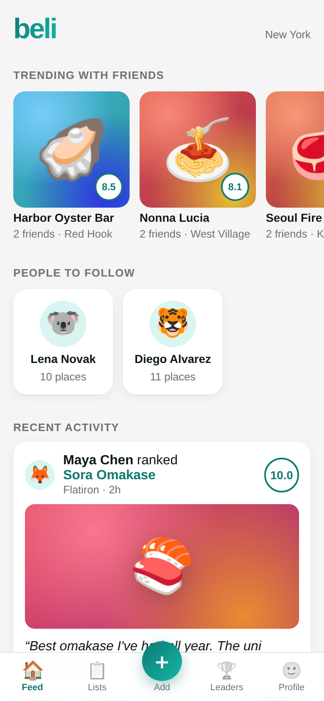
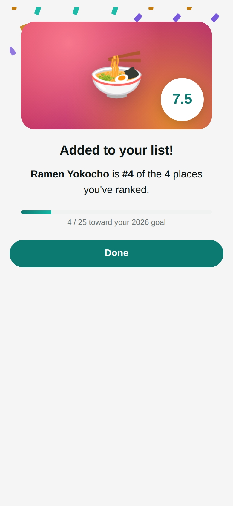
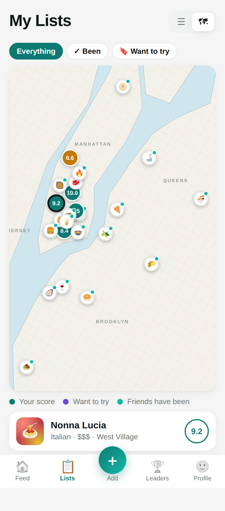
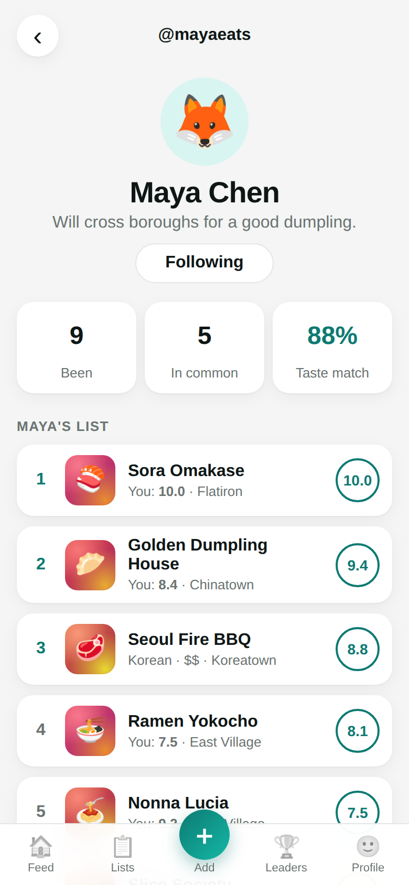
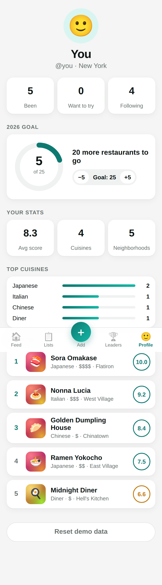

# Beli prototype

A mobile-first web prototype of a Beli-style restaurant ranking app, built with React, TypeScript and Vite.

<p>
  
  
  
</p>
<p>
  
  
  
</p>

## How ranking works

Instead of giving a star rating, you rank each new place against the places you've already ranked:

1. **Pick a sentiment:** *I liked it*, *It was fine*, or *I didn't like it*. Each maps to a score band (6.7–10, 3.3–6.6, 0–3.2).
2. **Compare head-to-head:** "Which do you prefer?" A binary search over that band's list finds the new place's slot in about log₂(n) questions. *Too tough to decide* places it next to the current comparison.
3. **Get a score:** places are spread evenly through their band by rank, so your favorite is always 10.0 and scores update as your list grows.

The logic is in `src/lib/ranking.ts`, with unit tests in `src/lib/ranking.test.ts`.

## Features

- **Feed:** a *Trending with friends* carousel, *People to follow*, and an activity feed with likes, one-tap save and one-tap rank.
- **Ranking flow:** sentiment, tags (such as *Date night* or *Great value*), notes, then head-to-head comparisons with a progress bar. It ends on a results screen with confetti showing your score, where the place lands in your list, and progress toward your goal.
- **Restaurant page:** cover art, description, tags, your score vs. friends' average, what each friend thought, your own visit notes, and *You might also like*.
- **Lists:** *Been* (grouped by Liked, Fine and Didn't like), *Want to Try*, and *Recs* (places you haven't been, ranked by the friends you follow). There's also a **map view** of NYC with pins colored by your score and filters.
- **Search:** by name, cuisine, neighborhood or tag, with price and cuisine filter chips. Results are sorted by friends' scores.
- **Friend profiles:** follow and unfollow, see their ranked list next to your own scores, and a **taste match %**.
- **Leaderboard:** *Most places* and *Taste match* boards.
- **Profile:** yearly goal ring (adjustable), average score, number of cuisines and neighborhoods, top-cuisine bars, and your top 5.
- Light and dark mode.

Data is fictional seed data (`src/data/seed.ts`), and cover images are generated gradients. Your data is saved to `localStorage`; use *Profile → Reset demo data* to clear it.

## Running it

```bash
npm install
npm run dev        # http://localhost:5173
npm test           # unit tests
npm run build      # typecheck + production build
```

## Possible next steps

- A real backend (auth, a real friend graph, shared data)
- Real restaurant data and photos (for example, Google Places)
- Photo uploads on reviews
- Multiple cities, and a real, zoomable map (for example, Mapbox or Leaflet)
