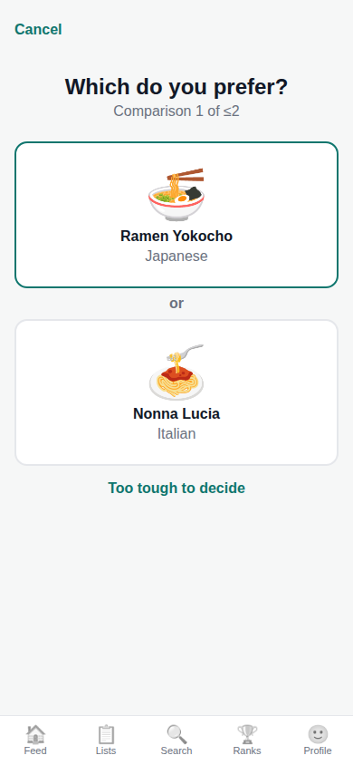
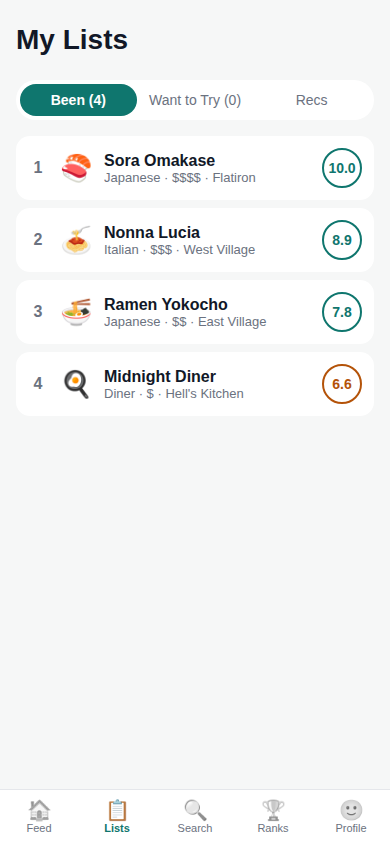

# Beli prototype

A mobile-first web prototype of a Beli-style restaurant ranking app, built with React, TypeScript and Vite.

<p>
  
  
</p>

## How ranking works

Instead of giving a star rating, you rank each new place against the places you've already ranked:

1. **Pick a sentiment:** *I liked it*, *It was fine*, or *I didn't like it*. Each maps to a score band (6.7–10, 3.3–6.6, 0–3.2).
2. **Compare head-to-head:** "Which do you prefer?" A binary search over that band's list finds the new place's slot in about log₂(n) questions. *Too tough to decide* places it next to the current comparison.
3. **Get a score:** places are spread evenly through their band by rank, so your favorite is always 10.0 and scores update as your list grows.

The logic is in `src/lib/ranking.ts`, with unit tests in `src/lib/ranking.test.ts`.

## Features

- **Feed:** activity from you and some seeded friends (rankings, notes, bookmarks).
- **Lists:** *Been* (your ranked list), *Want to Try* (bookmarks) and *Recs* (places you haven't been, sorted by friends' scores).
- **Search:** by name, cuisine or neighborhood.
- **Restaurant page:** your score, friends' average and individual friend scores, plus actions to rank or re-rank, bookmark, and remove.
- **Leaderboard:** places ranked by you and each friend.
- **Profile:** stats, top cuisines and your top 5.

Data is fictional seed data (`src/data/seed.ts`). Your data is saved to `localStorage`; use *Profile → Reset demo data* to clear it.

## Running it

```bash
npm install
npm run dev        # http://localhost:5173
npm test           # ranking unit tests
npm run build      # typecheck + production build
```

## Possible next steps

- A real backend (auth, friends and follow graph, shared data)
- Real restaurant data and maps (for example, Google Places)
- Photos and dish tags on reviews
- Per-city lists, filters (cuisine, price, distance) and a map view
